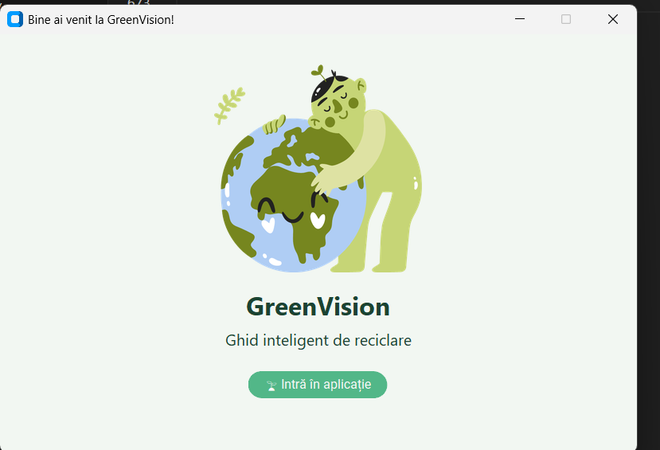
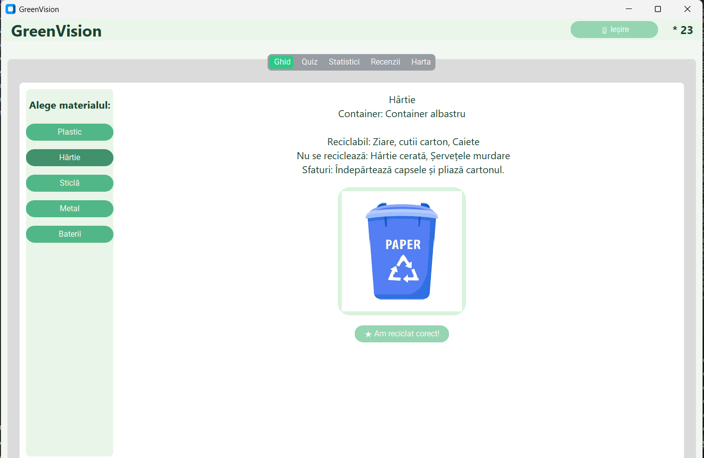
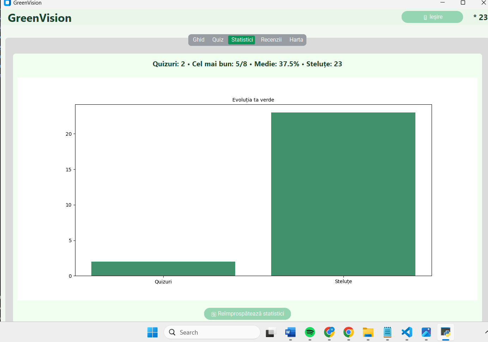
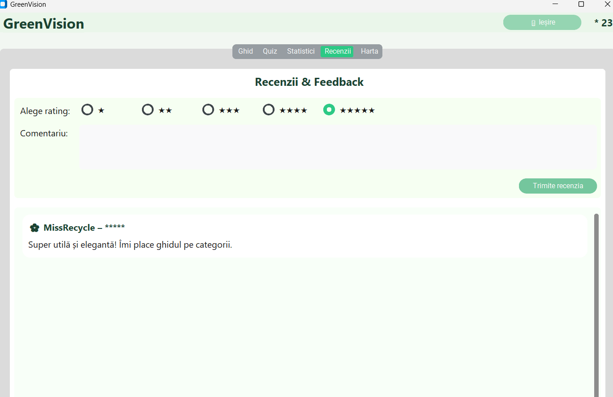
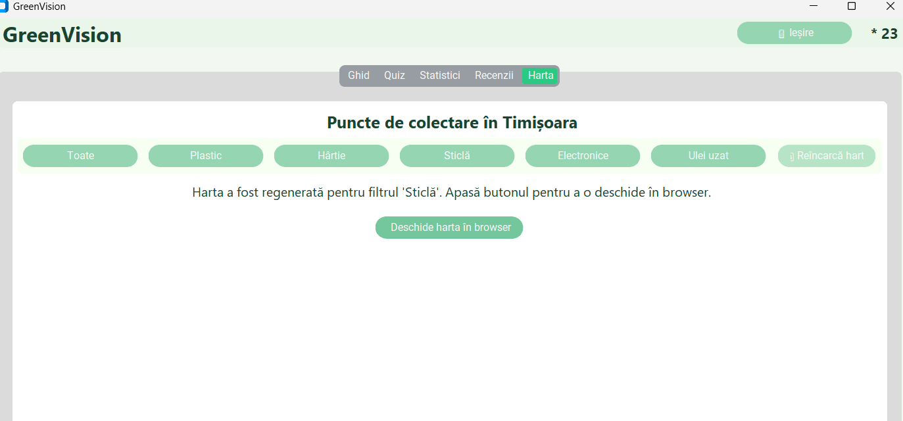

# GreenVision
Aplicație Descktop Python (CustomTkinter) pentru ghid de reciclare quiz,statisticv, recenzii si harta(Folium+SQLite)
#  oferă:
- **Ghid de reciclare** pe categorii (Plastic / Hârtie / Sticlă / Metal / Baterii)
- **Quiz** educativ cu întrebări random
- **Statistici** (stelute, scoruri quiz)
- **Recenzii** salvate local
- **Hartă interactivă (Folium)** cu puncte de colectare (deschisă în browser)
- **AI Recycle (Machine Learning local)**: introduci un obiect și primești categorie + confidence

> aplicația folosește o bază de date **SQLite locală** (`greenvision.db`) și un model ML local (`recycle_model.pkl`).


##  Structura proiectului
```text
GreenVision/
├── app.py
├── ml_model.py
├── ml_recycle_data.json
├── recycle_model.pkl
├── collect_points.json
├── map.html
├── greenvision.db
├── assets/
│   ├── 10f3ae10-7fdb-44ef-98b6-63421d11a7f2.png
│   ├── 06ed436b-2b05-4dbb-bf7a-32409c66a82b.png
│   ├── albastru.png
│   ├── dc42bea2-657a-427f-8cbf-ac33b19801b5.png
│   └── 144294ed-a719-4caf-b446-6de72ac4e46c.png
├── test_map.py
├── .venv/
├── requirements.txt
└── README.md

##  Rolul fișierelor

- **app.py**  
  Aplicația principală (UI CustomTkinter, DB, ML, hartă)

- **ml_model.py**  
  Modul de Machine Learning (antrenare + predicție)

- **ml_recycle_data.json**  
  Set de date pentru antrenarea modelului ML

- **recycle_model.pkl**  
  Model ML salvat automat (joblib)

- **collect_points.json**  
  Datele punctelor de colectare (folosite la hartă)

- **map.html**  
  Hartă interactivă generată cu Folium (Leaflet + OpenStreetMap)

- **greenvision.db**  
  Bază de date SQLite locală

- **assets/**  
  Imagini utilizate în interfață

- **test_map.py**  
  Script de test pentru hartă
##  Arhitectură logică (pe scurt)

- **UI Layer**: `app.py`  
  Gestionează interfața, evenimentele și afișarea datelor

- **Data Layer**: `greenvision.db` + `class DB`  
  Persistență locală cu SQLite

- **Machine Learning Layer**: `ml_model.py`  
  Clasificare text pentru reciclare (local, fără server)

- **Map Layer**: `collect_points.json` → `map.html`  
  Generare hartă cu Folium, afișare prin browser


##  API-uri utilizate

- **API extern (indirect)**:
  - OpenStreetMap Tiles API (prin Leaflet.js)
- **API intern (local)**:
  - DB API (class DB)
  - ML API local (ml_model.py)

> Aplicația nu folosește un REST API propriu (Flask/FastAPI), ci servicii locale și biblioteci Python.

## Tehnologii utilizate
- Python  
- CustomTkinter (UI)  
- SQLite (persistență date)  
- Folium (hărți interactive)  
- Pillow (procesare imagini)  
- Matplotlib (statistici – opțional)

## Instalare și rulare
1. Clonează repository-ul:
   ```bash
   git clone https://github.com/mara479/GreenVision.git
   cd GreenVision

## Screenshots






